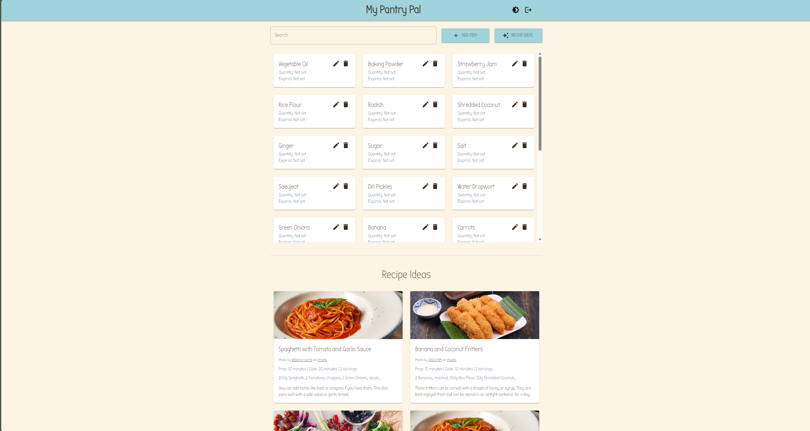
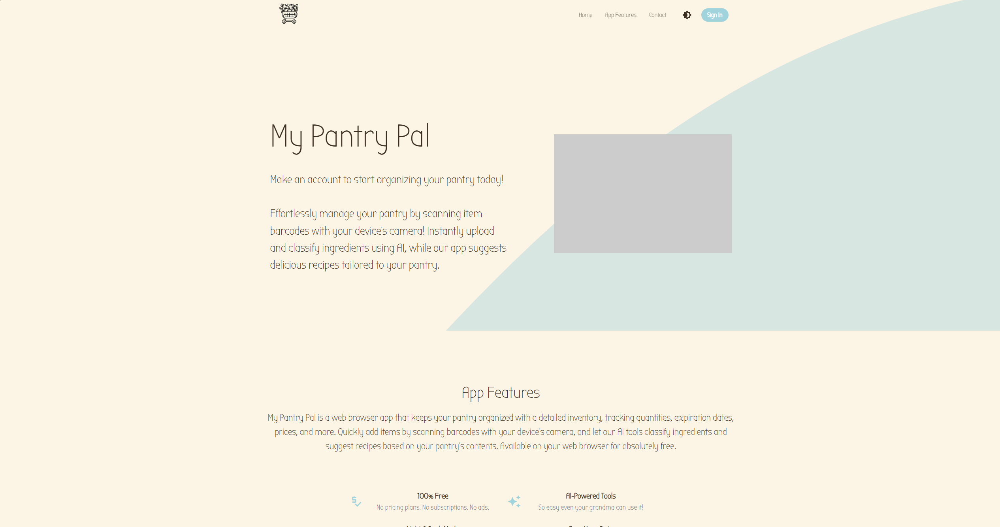

# My Pantry Pal

My Pantry Pal is a pantry-management web app for keeping track of what food you have and figuring out what you can actually make with it.

I built it as a full-stack Next.js/TypeScript project with Firebase Authentication, per-user Firestore storage, Material UI, and a server-side recipe API powered by OpenAI. The recipe feature is designed to be practical: it looks for compatible groups of pantry items, avoids recipes that require ingredients you do not have, and does not try to force every item in your pantry into one strange dish.

## Screenshots

**Pantry dashboard**



**Landing page**



## What It Does

- Lets users sign up, sign in, and sign out with Firebase Authentication
- Stores each user's pantry separately in Cloud Firestore
- Supports adding, editing, deleting, searching, and merging matching pantry items
- Tracks optional quantities, units, and expiration dates
- Requires at least 5 pantry items before generating recipe ideas
- Generates up to 3 recipe ideas at a time from compatible pantry subsets
- Avoids duplicate recipe ideas that have already been shown
- Rejects recipe candidates that introduce unsupported ingredients
- Uses Pexels for recipe photos when configured, with a generated fallback image
- Includes light and dark mode
- Has a responsive landing page plus an authenticated pantry dashboard

## Recipe Generation

The recipe generator answers a specific question:

> What sensible dishes can I make from some combination of what I already have?

It does not assume every pantry item belongs together. If your pantry contains spaghetti, tomatoes, garlic, bananas, rice flour, and pickles, the app should be able to use the pasta ingredients for one recipe and ignore the unrelated items.

The server-side recipe flow:

1. Receives the user's pantry items from the inventory page.
2. Checks that there are at least 5 pantry items.
3. Builds a prompt asking OpenAI for realistic recipes using compatible ingredient subsets.
4. Asks for structured JSON, not free-form text.
5. Validates the generated recipes before returning them to the client.
6. Fetches a matching Pexels food photo when a Pexels API key is available.

Validation checks include:

- Duplicate recipe titles
- Ingredients that are not in the user's pantry
- Obviously incompatible food combinations
- Unexpected or malformed model responses

The app allows common basics like water, salt, pepper, dried herbs, and spices. Other ingredients should come from the user's pantry.

## Tech Stack

- **Framework:** Next.js 14, React 18, TypeScript
- **UI:** Material UI, Emotion, MUI Icons
- **Auth:** Firebase Authentication
- **Database:** Cloud Firestore
- **Backend:** Next.js API routes
- **AI:** OpenAI API
- **Recipe photos:** Pexels API
- **Other notable packages:** Axios, Google Cloud AI Platform client package
- **Deployment:** Vercel

## Project Structure

```text
my-pantry-pal/
|-- public/
|   |-- assets/
|-- src/
|   |-- components/
|   |   |-- sections/
|   |   |-- ui/
|   |-- lib/
|   |   |-- recipeGeneration.ts
|   |-- pages/
|   |   |-- api/
|   |   |   |-- recipe.ts
|   |   |-- _app.tsx
|   |   |-- _document.tsx
|   |   |-- index.tsx
|   |   |-- inventory.tsx
|   |-- styles/
|   |-- firebase.ts
|-- firestore.rules
|-- package.json
|-- next.config.mjs
|-- tsconfig.json
```

## Important Files

`src/pages/inventory.tsx`

The authenticated pantry dashboard. It handles inventory actions, search, recipe cards, recipe details, auth state, and light/dark mode.

`src/firebase.ts`

Firebase setup plus helper functions for authentication and Firestore inventory operations.

`src/pages/api/recipe.ts`

The server-side recipe endpoint. It talks to OpenAI, validates generated recipe candidates, fills partial recipe batches, and fetches recipe photos.

`src/lib/recipeGeneration.ts`

Shared recipe-generation logic: prompt construction, compatible-subset hints, duplicate prevention, ingredient validation, global-cuisine discovery guidance, and supplemental recipe generation.

`firestore.rules`

Firestore security rules that restrict each user's profile and inventory documents to that authenticated user's UID.

## Getting Started

Install dependencies:

```bash
npm install
```

Create a `.env.local` file in the project root:

```env
# Firebase
NEXT_PUBLIC_FIREBASE_API_KEY=
NEXT_PUBLIC_FIREBASE_AUTH_DOMAIN=
NEXT_PUBLIC_FIREBASE_PROJECT_ID=
NEXT_PUBLIC_FIREBASE_STORAGE_BUCKET=
NEXT_PUBLIC_FIREBASE_MESSAGING_SENDER_ID=
NEXT_PUBLIC_FIREBASE_APP_ID=
NEXT_PUBLIC_FIREBASE_MEASUREMENT_ID=

# OpenAI
OPENAI_API_KEY=

# Optional: override the recipe model
OPENAI_RECIPE_MODEL=gpt-4o-mini

# Optional: recipe photography
PEXELS_API_KEY=
```

Never commit API keys or private environment values.

Start the development server:

```bash
npm run dev
```

Then open [http://localhost:3000](http://localhost:3000).

## Firebase Setup

Create a Firebase project and enable:

1. Firebase Authentication with the Email/Password provider
2. Cloud Firestore

Pantry items are stored under each authenticated user:

```text
users/{uid}/inventory/{itemId}
```

Each pantry item can include:

```text
type
quantity
unit
date
```

`quantity`, `unit`, and `date` are optional from the user's point of view.

The included `firestore.rules` file restricts access so users can only read and write their own user document and inventory collection.

## API Overview

Recipe generation happens through:

```text
POST /api/recipe
```

Example request shape:

```json
{
  "pantry_items": [
    {
      "name": "Spaghetti",
      "quantity": 1,
      "unit": "units"
    },
    {
      "name": "Tomatoes"
    },
    {
      "name": "Garlic"
    }
  ],
  "excluded_recipe_titles": [
    "Spaghetti with Tomato and Garlic Sauce"
  ]
}
```

The API returns a list of validated recipe ideas. Each recipe includes a title, timing, servings, ingredient amounts, beginner-friendly directions, suggestions, an image query, and either a Pexels image or a fallback generated image.

## Available Scripts

```bash
npm run dev
npm run build
npm run start
npm run lint
npm run test
```

## Current Limitations

The pantry page currently includes camera and image-upload buttons, but those flows are placeholders. Future versions could use them for barcode scanning, receipt scanning, or ingredient recognition from photos.

Recipe generation is validated before display, but AI-generated cooking instructions should still be treated as suggestions rather than food-safety guidance. Recipe quality also depends on how clearly pantry items are named.

## Future Ideas

- Camera-based pantry entry
- Barcode scanning
- Receipt scanning
- Expiration reminders
- Shopping lists
- Saved or favorite recipes
- Recipe history per user
- Dietary preferences and allergy filters
- Serving-size adjustments
- Nutrition information
- More advanced recipe deduplication
- Automated tests around inventory helpers and the recipe API

## Why I Built It

I wanted the app to solve a very normal kitchen problem: deciding what to cook from the food that is already sitting around.

The interesting part became connecting a real inventory system to recipe generation in a way that stays grounded. My Pantry Pal is not just asking AI to write a recipe; it is trying to keep the model honest about what the user actually has.
